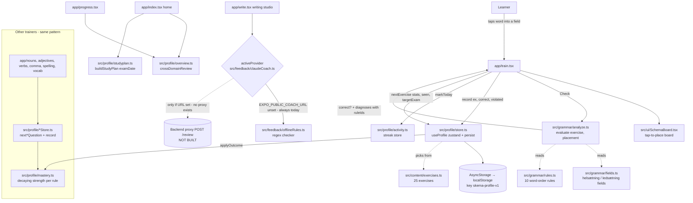

# Skema (`dansk-grammatik`): Project Summary

Interview-prep notes. Everything below is checked against the code as of commit `0023dfa` (Oct 2026). Every claim names the file it comes from.

Status labels used throughout:
- ✅ **Implemented**: the code exists and runs.
- 🟡 **Partial**: some of it works.
- 🔌 **Stubbed**: the interface is written but there's no working backend.
- ❌ **Not implemented**: there is no code for it.

---

## 1. Purpose

Skema is a Danish grammar and exam-prep app for adult learners preparing for the Danish exams PD2, PD3 and FVU. Learners practise word order by placing words into Diderichsen's *sætningsskema* (the Danish sentence-field model). Rule-based feedback explains which rule they broke. A decaying per-rule mastery model chooses what to practise next (`README.md`, `src/grammar/fields.ts`, `src/grammar/analyze.ts`, `src/profile/mastery.ts`).

---

## 2. Tech stack

**Language:** TypeScript, strict mode (`tsconfig.json` extends `expo/tsconfig.base` with `"strict": true`).

**Runtime dependencies** (`package.json`):

| Dependency | Used for | Evidence |
|---|---|---|
| `expo` ~57 | App framework, build and dev server | `package.json` scripts |
| `expo-router` ~57 | File-based routing for every screen under `app/` | `"main": "expo-router/entry"`, `app/_layout.tsx` |
| `react` 19.2 / `react-native` 0.86 | UI | all `app/*.tsx`, `src/ui/*.tsx` |
| `react-native-web` / `react-dom` | Web target (the deployed build is web) | `app.json` → `web.bundler: "metro"`, `output: "single"` |
| `@expo/metro-runtime` | Metro runtime for the web bundle | `package.json` |
| `zustand` ^5 | State stores with `persist` middleware | `src/profile/*Store.ts`, `store.ts`, `settings.ts`, `activity.ts` |
| `@react-native-async-storage/async-storage` | Persistence backend for zustand (uses `localStorage` on web) | `createJSONStorage(() => AsyncStorage)` in `src/profile/store.ts` |
| `react-native-safe-area-context` | Safe-area insets on every screen | e.g. `app/progress.tsx` |
| `react-native-screens`, `react-native-gesture-handler`, `react-native-reanimated` | Navigation and runtime peers that expo-router needs. The app code doesn't use gestures or animations directly (it uses tap-to-place, see `src/ui/SchemaBoard.tsx`) | `package.json`, `babel.config.js` |
| `expo-status-bar` | Status-bar style follows the theme | `app/_layout.tsx` |
| `expo-constants`, `expo-linking` | Expo runtime / deep-link support (`app.json` → `"scheme": "skema"`). The app's own outbound links use React Native's `Linking` | `app/exam.tsx`, `app/topics/[id].tsx` |
| `babel-preset-expo` | Babel preset. `babel.config.js` also loads `react-native-worklets/plugin` (installed as a transitive dependency of reanimated, not listed in `package.json`) | `babel.config.js` |

**Dev dependencies:** `typescript` ~6, `vitest` ^3 (unit tests), `@types/react`.

**Hosting:** a static web export deployed to Vercel. SPA fallback rules are in `public/vercel.json` and `public/_redirects`.

**Not present:** no backend server, no database, no LLM SDK, no embeddings or vector store, no speech or audio libraries.

---

## 3. Architecture

Skema is a client-only app. A "request" is a learner action: the screen calls pure domain functions, then saves the result to a persisted zustand store.



**How it works.** The word-order loop works like this:
1. `app/train.tsx` asks `nextExercise()` (`src/profile/store.ts`) for an exercise.
2. The learner places tokens on `SchemaBoard`.
3. `evaluate()` (`src/grammar/analyze.ts`) compares the placement with the answer key and any accepted alternatives, and returns `Diagnosis[]` keyed to `RuleId`s.
4. `record()` folds the outcome into each targeted rule's `ItemStat` using `applyOutcome()` (`src/profile/mastery.ts`).
5. The store persists automatically, and the next exercise is scored from the updated mastery.

The noun, adjective, verb, comma, spelling and vocabulary trainers follow the same pattern with their own stores. The home screen and the progress page combine all seven domains through `crossDomainReview()` (`src/profile/overview.ts`).

---

## 4. File map

| Path | Responsibility |
|---|---|
| `app/_layout.tsx` | Root Stack navigator, screen titles, theme resolution for the header and status bar |
| `app/index.tsx` | Home: first-run onboarding, grammar map, "widest gap" card, study-plan readiness, entry cards for all modules |
| `app/train.tsx` | Word-order trainer (the core loop) |
| `app/rule/[id].tsx` | Rule card: explanation, common mistakes, wrong/right pairs, learner's mastery |
| `app/nouns.tsx`, `adjectives.tsx`, `verbs.tsx`, `comma.tsx`, `spelling.tsx`, `vocab.tsx` | Six more trainers (multiple choice or flashcards) |
| `app/write.tsx` | Writing studio: official PD3 2022 tasks plus practice tasks, checked by `activeProvider()` |
| `app/topics/index.tsx`, `[id].tsx`, `practice.tsx`, `practice/[id].tsx` | Oral-exam topic archive with search and year filter, topic Q&A with model answers, practice topics |
| `app/exam.tsx` | PD3 exam guide (format, timings, tips, links to official sample PDFs) |
| `app/progress.tsx` | Overall mastery, daily streak, per-trainer progress |
| `app/settings.tsx` | Theme (System/Light/Dark), target exam, exam date |
| `src/grammar/fields.ts` | Field definitions for main clauses (helsætning) and subordinate clauses (ledsætning) |
| `src/grammar/rules.ts` | 10 word-order `RuleId`s with explanations, examples and exam tags |
| `src/grammar/analyze.ts` | `evaluate()` (diagnostic engine), `renderSentence()`, `trayTokens()` |
| `src/grammar/{noun,adjective,verb,comma,spelling}Rules.ts` | Rule definitions for the other trainers (3 + 3 + 3 + 3 + 4 rules) |
| `src/grammar/*Exercise.ts` | Pure question builders for those trainers |
| `src/content/*.ts` | Hand-written content: 25 word-order exercises, 35 vocabulary entries, 26 nouns, 14 adjectives, 29 verbs, 13 comma examples, 23 spelling examples, 60 oral topics with Q&A, 2 title-only sessions, 6 practice topics |
| `src/profile/mastery.ts` | Shared decay and levelling maths (`applyOutcome`, `decayedStrength`, `levelOf`, `progressFor`) |
| `src/profile/store.ts` | Word-order profile store, `ruleProgress`, `summarize`, `nextExercise` |
| `src/profile/{noun,adjective,verb,comma,spelling,vocab}Store.ts` | Per-domain stores and `next*` selectors |
| `src/profile/overview.ts` | Combines all 7 domains into one review list |
| `src/profile/studyplan.ts` | Exam-date pacing → readiness tag |
| `src/profile/activity.ts` | Active-days store and `computeStreak()` |
| `src/profile/settings.ts` | Settings store, `resolveThemeMode`, date helpers |
| `src/feedback/types.ts` | `WritingTask`, `Correction`, `WritingFeedback`, `FeedbackProvider` contracts |
| `src/feedback/offlineRules.ts` | Deterministic regex writing checker |
| `src/feedback/claudeCoach.ts` | LLM coach provider (stubbed transport) and system prompt |
| `src/ui/SchemaBoard.tsx` | The interactive field board |
| `src/ui/theme.tsx`, `src/theme.ts` | Theme context/provider and colour/spacing tokens |
| `src/ui/primitives.tsx`, `Screen.tsx`, `Onboarding.tsx` | Shared UI components and the first-run exam picker |
| `src/test/asyncStorageMock.ts` | In-memory AsyncStorage used in tests (aliased in `vitest.config.ts`) |

---

## 5. LLM usage

🔌 **Stubbed: no LLM is called anywhere in the running app.**

- **Model:** none is configured. `src/feedback/claudeCoach.ts` is written for a *Claude-backed* coach, but it names no model, includes no SDK, and makes no direct Anthropic call.
- **How it would run:** through a self-hosted backend proxy. `claudeProvider.review()` POSTs a `CoachRequest` to `${EXPO_PUBLIC_COACH_URL}/review`, and the proxy would hold the API key. **That proxy does not exist in this repo.** No Ollama, Groq or local model is used either.
- **Gate:** `isAvailable()` returns `COACH_URL.length > 0`. The URL is never set, so `activeProvider()` always returns `offlineProvider` (`src/feedback/claudeCoach.ts`).
- **Main prompt:** `COACH_SYSTEM_PROMPT` in `src/feedback/claudeCoach.ts`. It tells the model to act as a PD3 writing examiner, quote the exact span for each correction, give the corrected form, name the rule and explain why in at most two sentences, refer to the *sætningsskema* field for word-order errors, avoid rewriting the text wholesale, and return JSON matching `WritingFeedback` with character offsets.
- **Gaps even if the proxy existed:** `focusRules` is always `[]` and `targetExam` is hard-coded to `'PD3'` in `review()`. The learner's weak rules and chosen exam are not passed through yet.
- **What actually reviews writing:** `checkText()` in `src/feedback/offlineRules.ts`. It's a regex checker for three error patterns:
  1. ikke-regel (adverb placement in subordinate clauses)
  2. missing inversion after a fronted adverbial
  3. "og" used where the infinitive marker "at" is needed

  It also adds a word-count note for essays.

---

## 6. RAG details

❌ **Not implemented.** There's no document indexing, chunking, embeddings, vector store or retrieval. Content is static TypeScript arrays (`src/content/*.ts`). The topic archive "search" (`app/topics/index.tsx`) is a case-insensitive substring match over titles, questions and answers, plus a year filter.

---

## 7. Features

| Feature | Status | Evidence |
|---|---|---|
| **Conversational Danish practice** | ❌ Not implemented as conversation | No chat UI, no LLM call, no speech input or output (no audio dependencies in `package.json`; nothing in `app/`). The nearest thing is the oral-exam Q&A archive: learners read a real exam question, answer aloud on their own, then reveal a fixed model answer (`app/topics/[id].tsx`, `src/content/topics.ts`). That's static content, not dialogue. |
| **Contextual translations** | 🟡 Partial: static only | Each vocabulary entry carries `glossEn`, a Danish `definitionDa`, an `example` sentence from the topic archive, and `exampleEn` (`src/content/vocabulary.ts`, shown in `app/vocab.tsx`). Each word-order exercise has an English `gloss` (`src/grammar/types.ts`). No on-demand translation of arbitrary text, and no translation API. |
| **Adaptive lesson generation** | 🟡 Partial: adaptive *selection*, not *generation* | Exercises are hand-written. What adapts is which item comes next. `nextExercise()` (`src/profile/store.ts`) scores each exercise by `(1 − weakest targeted rule strength) + unseen bonus + not-yet-solved bonus + target-exam bonus − repeat penalty + jitter`. The per-domain `next*Question()` functions (e.g. `src/profile/nounStore.ts`) and `nextWord()` (`src/profile/vocabStore.ts`) pick the weakest rule or word first. Strength decays with a 12-day half-life (`HALF_LIFE_DAYS`, `src/profile/mastery.ts`). `buildStudyPlan()` (`src/profile/studyplan.ts`) paces work against an exam date. **No content is generated.** |
| **Grammar features** | ✅ Implemented | See below |

**What the grammar features include:**
- **Word order (the core).** Interactive *sætningsskema* with main-clause and subordinate-clause layouts (`src/grammar/fields.ts`, `src/ui/SchemaBoard.tsx`).
  - Accepts alternative valid orders (`Exercise.alternatives`).
  - `evaluate()` diagnoses 10 named rules (`src/grammar/rules.ts`): V2 inversion, ikke-regel, single Forfelt, finite verb second, subject required, verb-cluster order, central vs. content adverbial, object order, relative clauses, adverbial order.
  - Reports upstream errors first and gives partial-credit `accuracy` (`src/grammar/analyze.ts`).
- **Noun gender and definiteness:** en/et, the definite suffix, double definiteness (`src/grammar/nounRules.ts`, `app/nouns.tsx`).
- **Adjective agreement:** common, neuter and -e forms (`src/grammar/adjectiveRules.ts`).
- **Verb tenses:** weak-verb suffix, strong-verb forms, perfect auxiliary (`src/grammar/verbRules.ts`).
- **Commas:** men vs. og, lists, relative clauses (`src/grammar/commaRules.ts`).
- **Spelling (FVU-oriented):** silent d, silent h in hv-, nogen/nogle, og/at (`src/grammar/spellingRules.ts`).
- **Rule cards** with wrong/right pairs (`app/rule/[id].tsx`).
- **Writing checker:** offline regex, 3 patterns (`src/feedback/offlineRules.ts`).

**Other implemented features:**
- 7-domain mastery overview (`src/profile/overview.ts`)
- Progress page and daily streak (`app/progress.tsx`, `src/profile/activity.ts`)
- System/Light/Dark theme (`src/profile/settings.ts`)
- Onboarding exam picker (`src/ui/Onboarding.tsx`)
- PD3 exam guide (`app/exam.tsx`)

---

## 8. Data storage, configuration, running

**Storage.** All state is local to the device. Nine zustand stores use `persist` with AsyncStorage, which becomes `localStorage` on web:

| Store key | Source file |
|---|---|
| `skema-profile-v1` | `src/profile/store.ts` |
| `skema-vocab-v1` | `src/profile/vocabStore.ts` |
| `skema-nouns-v1` | `src/profile/nounStore.ts` |
| `skema-adjectives-v1` | `src/profile/adjectiveStore.ts` |
| `skema-verbs-v1` | `src/profile/verbStore.ts` |
| `skema-comma-v1` | `src/profile/commaStore.ts` |
| `skema-spelling-v1` | `src/profile/spellingStore.ts` |
| `skema-settings-v1` | `src/profile/settings.ts` |
| `skema-activity-v1` | `src/profile/activity.ts` |

There are no accounts, no server and no sync. Word-order history is capped at 300 entries (`src/profile/store.ts`) and active days at 400 (`MAX_DAYS`, `src/profile/activity.ts`).

**Configuration.** The only environment variable is `EXPO_PUBLIC_COACH_URL`, which is unset (`src/feedback/claudeCoach.ts`). App identity is in `app.json`: name "Skema", bundle id `dk.skema.app`, scheme `skema`.

**Running it** (`package.json` scripts):

```bash
npm install
npx expo start
```

Add `--web`, `--android` or `--ios` to pick a platform.

```bash
npm test
```

```bash
npm run typecheck
```

```bash
npm run build:web
```

`npm run build:web` creates a static `dist/`. `npm run serve:web` serves `dist/` locally.

The README says Android builds and runs, and that iOS needs Xcode or EAS (`README.md` → "Platform status"). I didn't verify either in this review.

---

## 9. Tests

The test runner is Vitest with a Node environment (`vitest.config.ts`). It runs `src/**/*.test.ts`, with AsyncStorage aliased to an in-memory mock (`src/test/asyncStorageMock.ts`). Current state: **19 test files, 187 tests, all passing.**

What the tests cover:
- **Diagnostic engine:** `src/grammar/analyze.test.ts`
- **Question builders:** `src/grammar/{noun,adjective,verb,comma,spelling}Exercise.test.ts`
- **Mastery and selection logic:** `src/profile/model.test.ts`
- **Per-store behaviour:** `src/profile/*Store.test.ts`
- **Overview, study plan, streak and settings:** `src/profile/{overview,studyplan,activity,settings}.test.ts`
- **Offline checker:** `src/feedback/offlineRules.test.ts`
- **Topic data integrity:** `src/content/topics.test.ts`

What isn't tested:
- No UI or component tests, and no end-to-end tests. Screens were checked by hand in a browser.
- `claudeProvider` has no test, because there's no network layer to test against.

---

## 10. Known limitations, risks, improvements

**Limitations**
- **The AI coach is a stub.** No proxy exists; `focusRules` and `targetExam` are hard-coded (`src/feedback/claudeCoach.ts`).
- **The offline writing checker is narrow.** It only knows 3 regex patterns. It can't judge style, register or task fulfilment, and it says so in its notes (`src/feedback/offlineRules.ts`).
- **The content pool is small.** There are 25 word-order exercises (`src/content/exercises.ts`), so the "never repeat a solved one" bonus runs out quickly.
- **Content bug in practice topics.** In all 6 `PRACTICE_TOPICS`, the answer for each follow-up question is a copy of the main answer above it (`src/content/topics.ts`).
- **Speaking can't be practised with a partner.** There's no speech or conversation feature.
- **Exam coverage is uneven.** PD2 and FVU have tags and the spelling trainer, but no exam guide or official material like PD3 now has (`app/exam.tsx` is PD3-only).
- **The noun trainer ignores per-noun history.** `nextNounQuestion()` picks a random noun inside the weakest rule (`src/profile/nounStore.ts`).

**Risks**
- **Data loss.** Progress lives only in browser `localStorage`. Clearing site data erases it, and there's no export or sync.
- **No migrations.** Store keys are versioned (`-v1`), but there's no migration code yet for schema changes.
- **Copyright.** Exam material is transcribed from learner study sets and SIRI PDFs (`README.md` → "Content provenance"). Republishing needs care; long reading texts are linked rather than copied (`app/exam.tsx`).
- **Leaking an API key.** If the coach is ever wired up, the key must stay on the proxy. The code comments and README already insist on this.

**Obvious improvements**
1. Build the `/review` proxy and pass the real weak rules and target exam.
2. Generate exercises from templates or with an LLM, with checking, to grow the pool.
3. Add speaking practice: TTS for model answers, then speech-to-text plus LLM role-play.
4. Add export/import or cloud sync for progress.
5. Add component and E2E tests (e.g. React Native Testing Library or Playwright on the web build).
6. Add PD2 and FVU exam guides and official material.

---

## 11. Interview questions and answers

1. **How does the app know *why* an answer is wrong, not just *that* it's wrong?**
   `evaluate()` in `src/grammar/analyze.ts` compares where each token was placed with where the answer key put it. It maps each mismatch to a named `RuleId` and reports the most upstream error first (e.g. verb position before the slots that depend on it). It also accepts any placement listed in `Exercise.alternatives`, because Danish allows several valid orders.

2. **How is mastery modelled?**
   Each rule or word has an `ItemStat` (`src/profile/mastery.ts`). `applyOutcome()` blends 35% of the decayed prior strength with 65% of a recency-weighted score over the last 6 outcomes. Strength decays with a 12-day half-life. Levels run unseen → shaky → developing → solid → mastered, at thresholds of 0.4, 0.7 and 0.9.

3. **How does it decide what to practise next?**
   `nextExercise()` in `src/profile/store.ts` scores every exercise. Weakness of the weakest rule it targets counts most. Bonuses go to never-attempted rules, not-yet-solved exercises and the chosen exam. The last exercise gets a −1 penalty, and a little random jitter is added. The target exam is a bias, not a filter.

4. **Is there an LLM in production?**
   No. `src/feedback/claudeCoach.ts` defines the provider, request shape and system prompt, but `EXPO_PUBLIC_COACH_URL` is unset. So `activeProvider()` always returns the offline regex checker, and the UI shows which one reviewed the text.

5. **Why route LLM calls through a proxy instead of calling the API from the app?**
   Anything in a mobile or web bundle can be extracted. The key has to live server-side, and the proxy can also rate-limit per user. That reasoning is in the header comment of `src/feedback/claudeCoach.ts` and the README.

6. **Is there RAG?**
   No. Content is static TypeScript data. Topic search is substring matching (`app/topics/index.tsx`).

7. **How is progress saved?**
   With zustand `persist` over AsyncStorage, one versioned key per domain (e.g. `skema-profile-v1`). On web that means `localStorage`. There's no backend.

8. **How is the streak calculated, and what's the edge case?**
   `computeStreak()` in `src/profile/activity.ts` counts consecutive active days. If today hasn't been practised yet, it counts back from yesterday, so the streak doesn't show 0 in the morning. It only breaks once a full day is missed. Six tests cover this (`src/profile/activity.test.ts`).

9. **Why tap-to-place instead of drag-and-drop?**
   Dragging across seven narrow fields on a phone tests dexterity, not grammar, and it doesn't work with screen readers. The board is drawn as rows rather than columns so it fits on a phone (`src/ui/SchemaBoard.tsx` header comment).

10. **How are the light/dark theme and the navigation header kept in sync?**
    One pure function, `resolveThemeMode(pref, systemScheme)` (`src/profile/settings.ts`), is used by both `ThemeProvider` (`src/ui/theme.tsx`) and the root layout (`app/_layout.tsx`). The header and the body therefore can't resolve to different modes. It treats anything except `'dark'` (including `'unspecified'`) as light.
